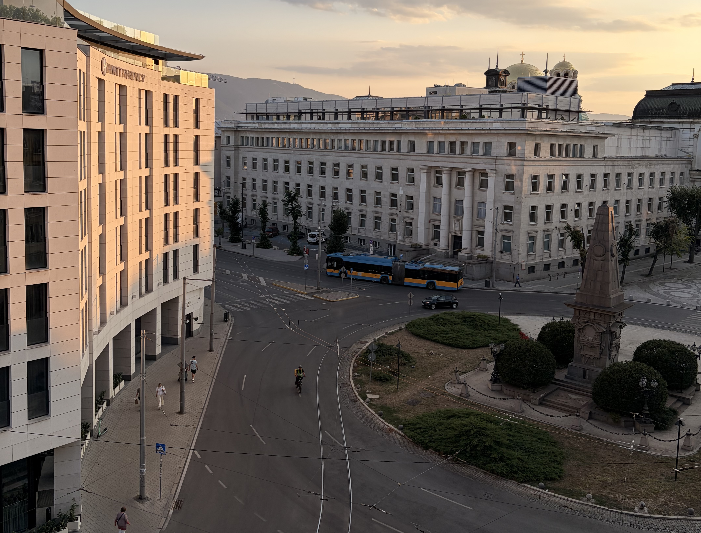
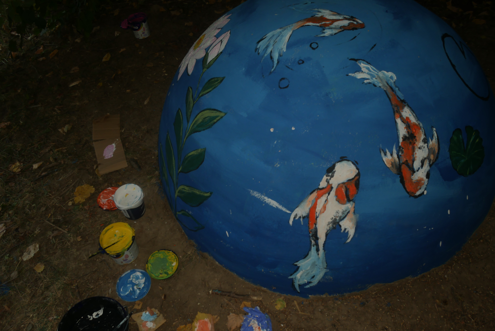
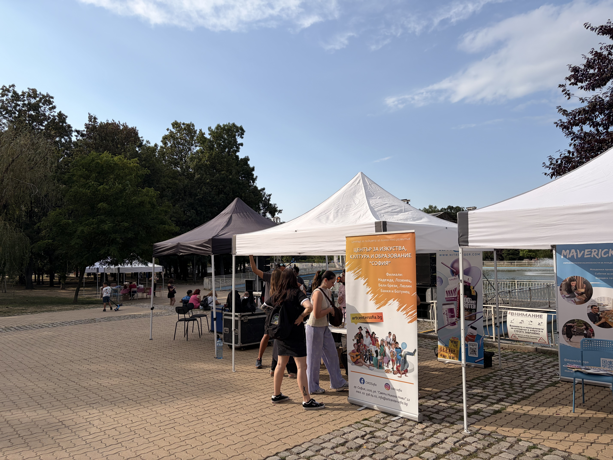

For anyone who doesn't know what I've actually signed up for: Colours of Solidarity is a European Solidarity Corps project based in Sofia, six volunteers spending a stretch of the year helping paint and clean up public spaces around the city, alongside cultural events organised with local partners. That's the short version. This is how the first two weeks of it actually went.

I flew out from Paris with a suitcase clearly packed by someone in denial about baggage limits. Sofia airport didn't make it easier either, we landed in a terminal with no metro connection and had to drag everything, six people and six suitcases, across to the one that did. Not the smoothest start. Somehow, it felt fitting. Nothing about this project has been polished from the outside.

Once all six of us were finally together in the flat, bags everywhere, it felt real in a way the online planning never quite managed. That kind of excitement is hard to fake. Half relief, half nerves, all pointed at something about to actually start.

The first real culture shock arrived fast, and it was banitsa. Cheap, everywhere, absurdly good for what it costs, thin pastry wrapped around cheese or ham or spinach depending on the day. On a European Solidarity Corps allowance, you learn quickly what counts as good value, and banitsa might be the best deal in the entire city. It has become something close to law among the six of us, along with the discovery that locals here do not hand out smiles for free. It is not coldness. It is just not a performance.

The actual work started with benches, tired and peeling across several of Sofia's parks, then moved on to a row of plain white stones in South Park that had been sitting there blank for who knows how long. We turned some into fish, some into flowers, small bursts of colour where there had been none. There is a real difference between volunteering as an idea and standing in a park with paint on your hands, watching a space change because you are the one changing it. It gives you a specific kind of usefulness that is hard to describe until you have felt it.

What I did not expect was how much the appreciation would matter. An older woman stopped us mid brushstroke, no English between us, and made it completely clear through gestures alone that she was grateful someone was fixing up her park. People keep stopping, keep thanking us in Bulgarian we mostly do not understand yet, and somehow the message lands anyway. That, more than the painting itself, has been the best part of these two weeks. Being useful is one thing. Having someone notice is another.

Two weeks in, and this is really just the first chapter. There is a festival still ahead, a language I am nowhere close to fluent in, and five people I am still learning to share a bathroom with.
