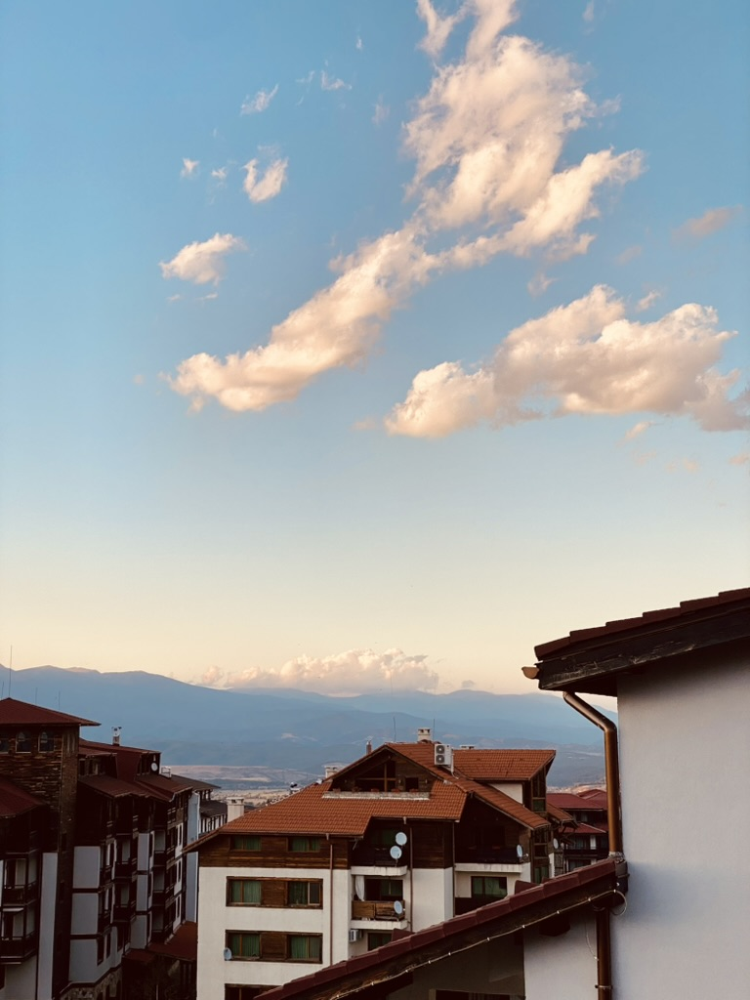
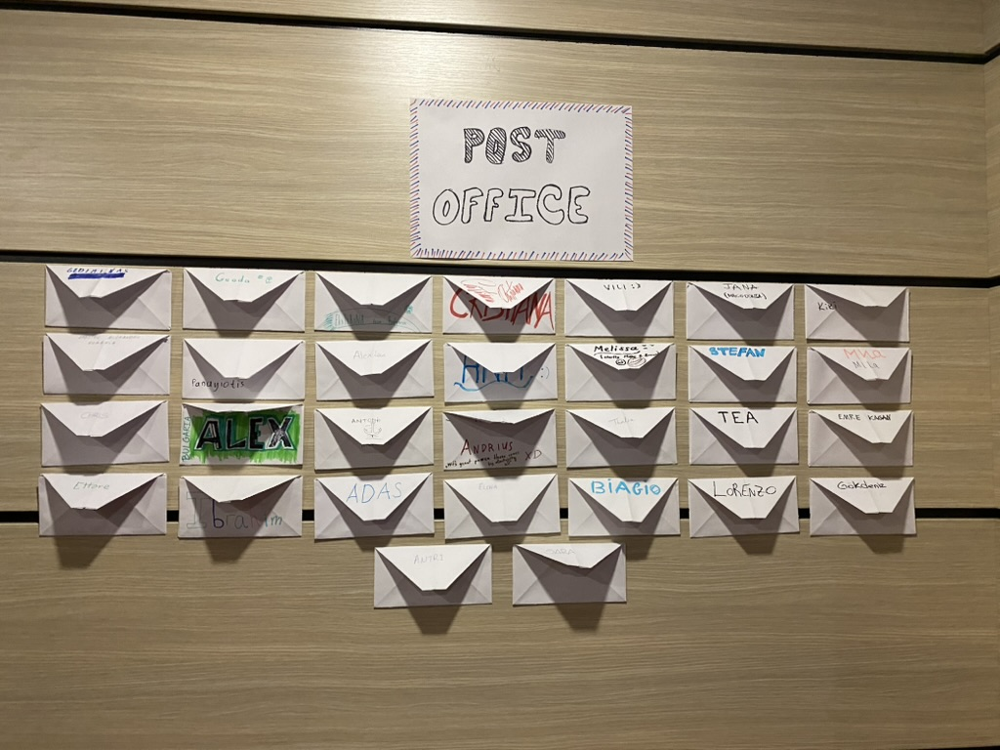
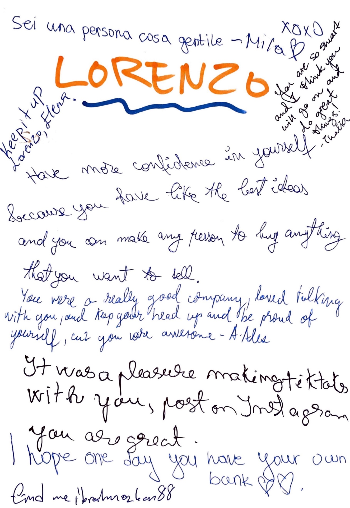

Eccomi lì, mentre scorrevo le opportunità Erasmus+, quando ho notato un altro progetto in Bulgaria. Ho esitato? Nemmeno per un secondo. C'ero già stato e mi ero divertito un mondo, e poi i prezzi non fanno male quando sei uno studente.

## La Bulgaria: il sequel

Lasciami fare un passo indietro. La mia prima avventura bulgara è stata a Sofia, ed è stata un po' casuale. Io e alcuni amici avevamo trovato dei voli ridicolmente economici da Bari, di quelli in cui ti chiedi se si siano dimenticati di aggiungere uno zero al prezzo. Ci siamo andati per un weekend, senza aspettarci nulla di speciale, e abbiamo finito per spassarcela un sacco. La città era vivace, le persone erano simpatiche e, da italiani, ci sentivamo come milionari con i nostri euro. Quindi quando ho visto che questo corso di formazione si teneva di nuovo in Bulgaria, ho pensato «iscrivetemi, ci torno!»

Colpo di scena però: questa volta non andavamo a Sofia. No, ci dirigevamo a Bansko, su tra le montagne. Non avevo la minima idea di cosa aspettarmi, ma ci stavo dentro al cento per cento.

## Atmosfera da cittadina di montagna

Questa volta ho conosciuto davvero il paese attraverso la gente del posto. Durante il mio viaggio a Sofia, ero fondamentalmente solo un turista che faceva cose da turista. A Bansko, i locali ci hanno fatto da guida, ci hanno raccontato storie, ci hanno portati in posti che da soli non avremmo mai trovato. È un'esperienza completamente diversa quando la tua guida è qualcuno che ci vive davvero invece di Google Maps.

## Veniamo al sodo

Ok, quindi cosa abbiamo fatto effettivamente per una settimana? Se guardi quel programma, potrebbe sembrare un mucchio di paroloni aziendali e gergo da workshop, ma in realtà è stato piuttosto coinvolgente. Sono riusciti a rendere non noioso l'apprendimento dell'imprenditoria, il che è onestamente un risultato notevole.

Abbiamo iniziato con il team building e la definizione degli obiettivi, che lo so sembra il tipo di cosa che ti fa venire voglia di alzare gli occhi al cielo, ma in realtà ci ha aiutati tutti a rilassarci e a capire cosa volevamo ottenere da tutta questa esperienza.

Poi è arrivata la parte pratica. Abbiamo avuto sessioni sulla gestione delle imprese, abbiamo imparato cose sulle start-up tech e abbiamo persino visitato vere aziende digitali per vedere come operano. I laboratori su WordPress sono stati sorprendentemente utili perché non ci limitavamo a guardare qualcuno cliccare in giro, costruivamo cose noi stessi. Si scopre che è molto più facile ricordare le cose quando sei tu a farle. Chi l'avrebbe detto?

Una cosa che mi è rimasta davvero impressa è stato il laboratorio sul Business Model Canvas. In pratica, è uno schema in cui mappi tutta la tua idea di business su una sola pagina. Sembra semplice, forse persino un po' sciocco, ma aiuta davvero a capire se la tua «idea geniale» ha effettivamente senso o se è solo qualcosa che sembrava buono alle 2 di notte. Spoiler: la maggior parte delle idee delle 2 di notte non sopravvive al test del canvas.

Abbiamo fatto anche un'analisi SWOT, che è un modo elegante per dire elencare cosa c'è di buono nella tua idea, cosa fa schifo, quali opportunità esistono e cosa potrebbe distruggerti. È come fare un bagno di realtà alla tua idea di business e, onestamente, ne avevamo tutti bisogno.

C'erano anche queste sessioni simpatiche e inaspettate, come «QR me!» in cui giocavamo con i QR code e gli strumenti digitali (ti ricordi quando i QR code sembravano futuristici?), e i «NGO mingles» in cui ci esercitavamo nel networking senza che sembrasse super imbarazzante e forzato.

La sessione sul crowdfunding mi ha un po' sconvolto. Avevo sempre pensato che servissero ricchi investitori o un prestito bancario per avviare qualcosa, ma no, a quanto pare puoi semplicemente convincere persone a caso su internet a darti dei soldi se la tua idea è abbastanza buona. Internet è strano e meraviglioso.

## La Posta (sì, davvero)

Per tutta la durata del progetto, avevamo questa cosa chiamata la Posta. Ognuno si costruiva la propria cassetta delle lettere di carta (alcuni sono stati davvero creativi con la loro), e le attaccavamo tutte su un muro con i nostri nomi sopra. In qualsiasi momento della settimana, se volevi dire qualcosa a qualcuno, lasciargli un biglietto, condividere un pensiero o semplicemente dire qualcosa di carino, potevi scriverlo e infilarlo nella sua cassetta.

L'ho adorato. A volte pensi a qualcosa che vuoi dire a qualcuno, ma il momento passa, oppure sembra imbarazzante tirarlo fuori così. Con la Posta, potevi semplicemente scriverlo non appena ti veniva in mente. Controllavo la mia cassetta ogni giorno, e trovarci dentro un nuovo biglietto mi faceva sempre sorridere.

Era un'idea così semplice, ma ha creato questa conversazione continua tra tutti noi, parallela a tutto il resto che facevamo. Inoltre, ci ha lasciato questi piccoli ricordi, oggetti tangibili da portare a casa. In un mondo in cui tutto è digitale, ricevere un biglietto scritto a mano da qualcuno ha qualcosa di speciale.

## A tavola!

A proposito di cibo, la cucina bulgara non scherza. È sostanziosa, è gustosa e ce n'è tanta. Parliamo di vero comfort food qui. E quando lo mescoli con piatti italiani, tapas spagnole e qualunque cosa abbiano portato gli altri, ottieni questo fantastico caos culinario che, chissà come, funziona alla perfezione.

Penso che si impari di più sulle persone a cena che in qualsiasi workshop, a dire il vero. Qualcuno cerca di spiegare il proprio piatto tradizionale, qualcun altro lo prende in giro per come pronuncia qualcosa, tutti ridono, condividono, rubano bocconi dai piatti degli altri. È lì che nascono i legami veri.

I bulgari che abbiamo incontrato erano super accoglienti, proprio come a Sofia. Hanno questo modo di farti sentire come se foste amici da sempre, anche quando li hai conosciuti cinque minuti prima.

## Quindi cosa ho imparato davvero?

Quando abbiamo concluso, sentivo sinceramente di avere in tasca alcuni strumenti utili. Non parlavamo solo di imprenditoria in modo astratto e teorico. Abbiamo imparato schemi concreti, giocato con veri strumenti digitali, presentato idee di business (alcune terribili, altre non così terribili) e ricevuto feedback onesti da persone che ne capiscono davvero.

Ma onestamente? Quello che ho imparato sul business e sull'imprenditoria era solo una parte. Le sessioni di feedback, la Posta, le conversazioni casuali, i pasti condivisi, tutto questo mi ha insegnato altrettanto sulla comunicazione, la collaborazione e la comprensione di persone con background diversi.

Tutto questo mix di workshop, visite ad aziende vere, pratica concreta, chiacchiere serali e fusioni culturali ne ha fatto molto più di un semplice corso di formazione. È stata una di quelle esperienze in cui lunedì ti presenti senza conoscere nessuno, e venerdì stai già facendo progetti per andarvi a trovare nei rispettivi paesi e restare in contatto. E alcuni di noi sono effettivamente rimasti in contatto, il che è piuttosto raro per queste cose.

## Il trucco del foglio sulla schiena

Una delle cose più belle che abbiamo fatto è stata questa attività di feedback durante la nostra riflessione finale. Immagina: ognuno aveva un foglio di carta attaccato alla schiena, e ci aggiravamo per la stanza mentre le persone ci fermavano e scrivevano cose sulla nostra schiena. Non avevi idea di cosa stessero scrivendo fino alla fine, il che la rendeva al tempo stesso emozionante e terrificante.

Le persone scrivevano cosa pensavano di te, suggerimenti per migliorare, parole di incoraggiamento, osservazioni varie. All'inizio era strano, sentire qualcuno scarabocchiare sulla tua schiena con una penna, ma i feedback che ho ricevuto erano sorprendentemente toccanti. Alcuni erano divertenti, altri davvero profondi, e tutti erano onesti in un modo in cui a volte le persone non lo sono quando ti sono di fronte.

Ho ancora alcuni di quei biglietti, e rileggerli fa riaffiorare tutti questi ricordi. C'è qualcosa di speciale nell'avere una prova fisica che le persone ti hanno notato, apprezzato o hanno pensato che avessi del potenziale. Molto meglio di una raccomandazione su LinkedIn, se vuoi il mio parere.

## Lo rifarei?

In un batter d'occhio. Montagne, neve d'estate, competenze pratiche che non ti fanno addormentare, persone fantastiche da tutta Europa, cibo incredibile, biglietti scritti a mano che conservo ancora da qualche parte e prezzi che rendono molto felici i portafogli italiani. Cosa non amare?

Se mai vedi un progetto Erasmus+ che sembra anche solo lontanamente interessante, vai e basta. Non pensarci troppo. Imparerai delle cose, conoscerai persone che diventano amici veri, mangerai decisamente troppo, probabilmente ti metterai in imbarazzo almeno una volta (io di sicuro l'ho fatto), girerai con un foglio attaccato alla schiena, controllerai una cassetta delle lettere fai-da-te in cerca di biglietti come se fossi di nuovo alle elementari, e tornerai con storie e competenze che ti restano dentro.

Bulgaria, Bansko, tutta questa storia del Digital Entrepreneurship Accelerator? Ne è valsa assolutamente la pena. 10/10, rifarei l'imprenditore.
