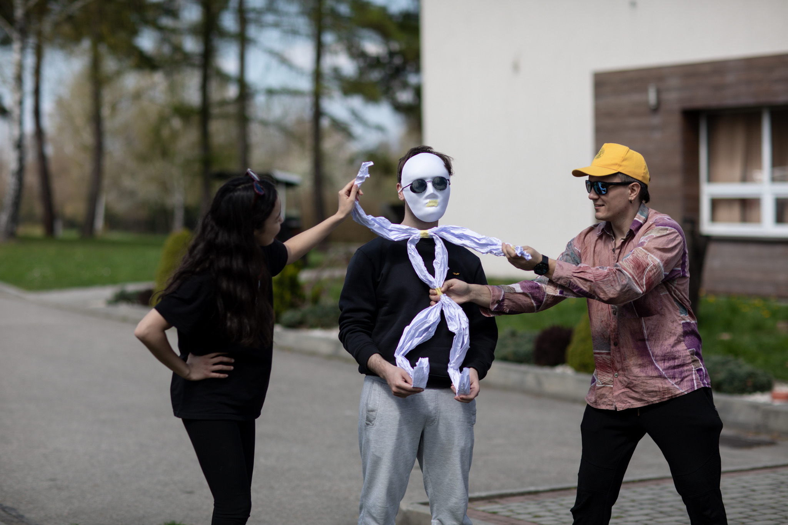
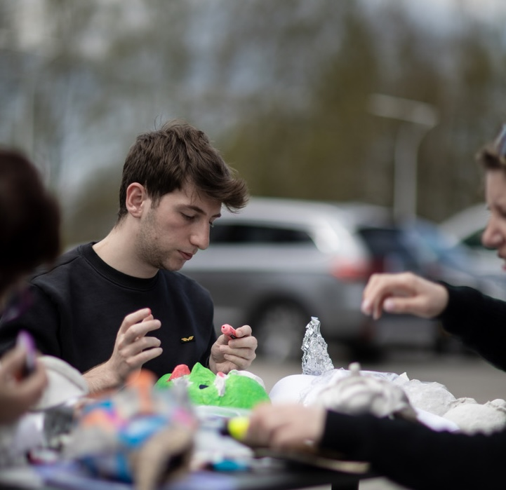

I am back in Dobczyce for the second training of Out the shadow.
I am so glad for this possiblity and to continue exploring the world of black light theatre and commedia dell'arte. Maciej and Ewelina facilitaded the workshops with great professionalism and in such a way that getting up early in the morning was (almost) something that I looked out for !

I already had the chance to appreciate their work in the first training and I am happy to work with the same team, find back familiar faces and spaces that already feel like home. 

From the participants there were many new faces, as well as some of the lovely people I had the chance to meet previously. I remember while waiting in the lobby with my italian group we saw a bold man coming in, hearing them talking portuguese. With my fellow colleagues we immediately thought "Oh that must be Hugo !" another participant from the first training. We started yelling his name as we approached him near the reception. He looked at us and laughed, then later another man that looked exactly like him got into the hotel. We realized that we were calling the wrong person. We hugged each other and then introduced us to his twin brother, Marco.

The first day we started with some ice breakers games and then we dived into the commedia dell'arte characters, which even tho I am italian I did not know before coming to this training. Some well-known character examples include Arlecchino (Harlequin), Pulcinella, Pantalone, il Dottore, Colombina, and Scaramuccia. We then played in little groups trying to impersonate the features of these characters. The next day we even went a step further and, enjoying the sunny weather outside, we painted and created our own masks with clay, colors and our personal touch.

Playing with the masks in the dark using glowing tapes and paint added an extra sensory experience to what I already felt the first time I discovered black light theatre last year.

I hope you watched our final perfomance, which is by now a tradition at the end of every OTS training. Or if you missed it, take a look at it [here](https://www.youtube.com/watch?v=qB-h_YFKQn0&list=PLiSKGLJK2MFrT31Ivb9OuG3bb1FBv9_08&index=33) :)

The next one is going to be in Italy, Taranto - hosted by our organization Hermes Academy. I am already looking forward to offer new inspirations to the awesome people we will host. Stay tuned !
