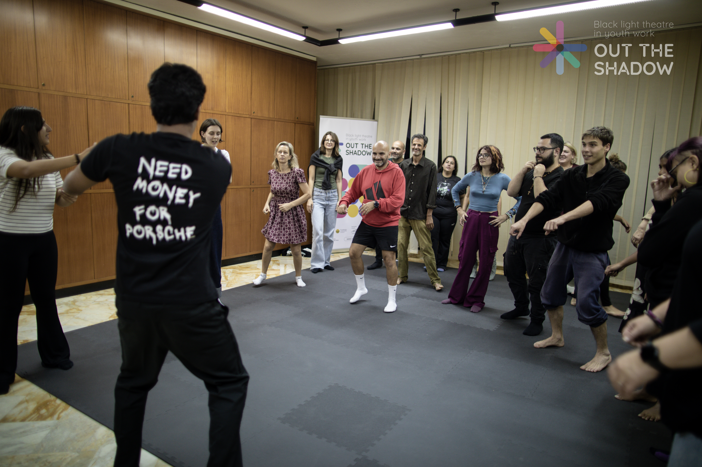
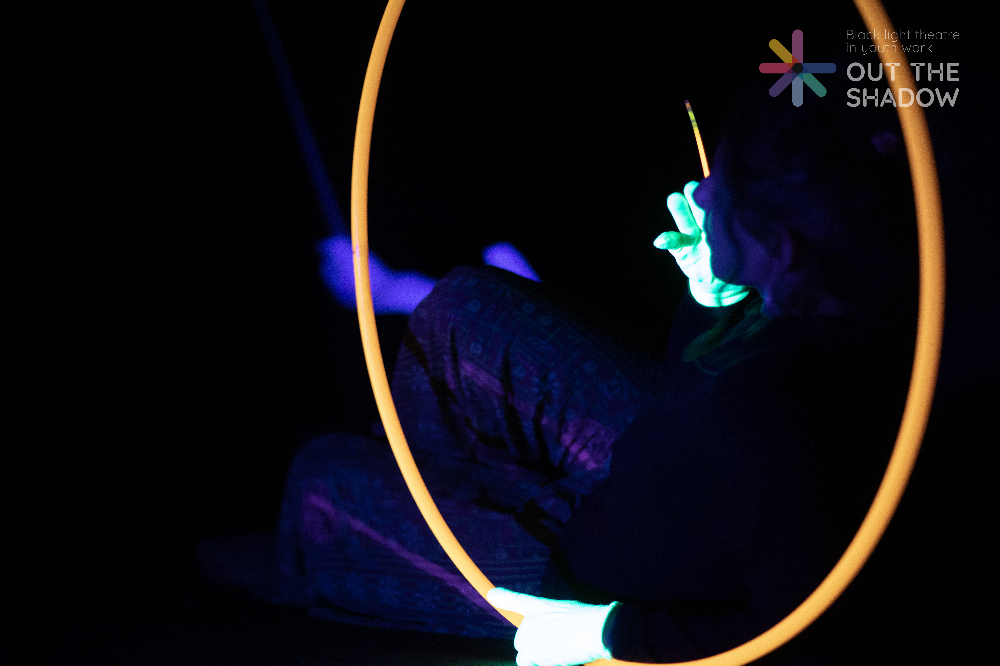
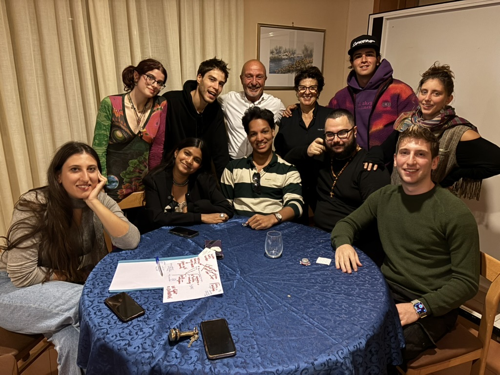

The time has come !

Black light theatre is coming to town, to the beautiful ionic city of Taranto, Italy. Hermes Academy is glad to be one of the very first associations to bring this theatre technique to Italy in the frame of the Erasmus+ programme.

After the direct experiences from the previous trainings held in Poland by our polish partner, Fundacja Innowacyjnej Edukacji, we are glad to welcome the heterogeneous group of people that have been selected to take part in this project. From students to artists and teachers, black light theatre is really a unique opportunity open to everyone willing to explore what is possible to achieve through theatre and artistic approaches to foster inclusion and self-expression among young people.

After a thoughtful research, the designated venue for the training has been the Hotel Plaza, which with its central localization allowed us to pursue off site activites without any issues.

The main focus of this mobility was to put in practice all the things we learnt from the 2 previous trainings, how to work in the dark, create patterns, storytelling, the use of puppets, the archetypes of commedia dell'arte but most importantly how to keep our audience engaged. No matter the age.

The invaluable support from the previous trainings participants helped us shape an environment where everybody was on the same page, able to work ad learn in optimal conditions.

We used the first days to get to know a bit better the city with an interactive treasure hunt where the participants had the chance to discover the great history of the greek city Taras and their landmarks. Following clues from the Aragonese Castle to the Ponte Girevole, where we admired the views of the canal. We then visited the Monumento al Marinaio, discovered the ancient Doric Columns, and explored the narrow streets of the Old Town. Our treasure hunt ended at Taranto Cathedral, after which we visited the MArTA Archaeological Museum and learned about the city’s Greek and Roman history.

The following days have been the perfect occasion to give space to our participants to explore and improvise with the different techniques : BLT, Shadow theatre, puppets etc. The main goal was to come up with at least 10 little plays that would then create the final perfomance, the closing ritual of every Out the Shadow project.

You can watch that [here](https://www.youtube.com/watch?v=TGDVo0kROkE&t=2s)

I am very glad to have taken part in the organization of this mobility and get a glimpse of how things worked on the "other side". The beautiful moments I experienced throughout this project will always hold a special place in my heart. See you soon at the final training session, which will take place in Madeira, Portugal.

