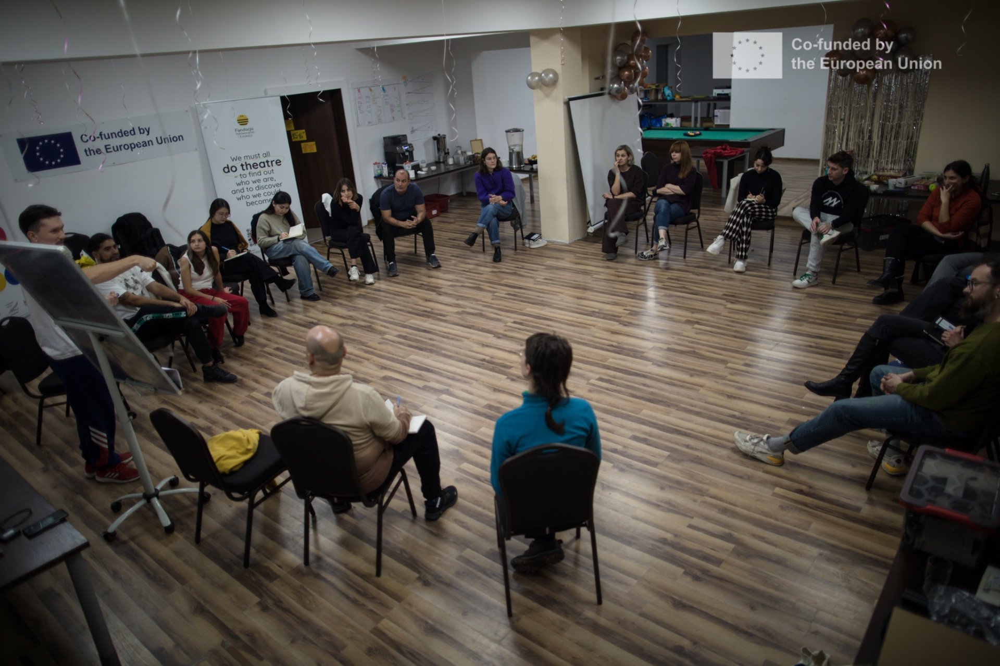
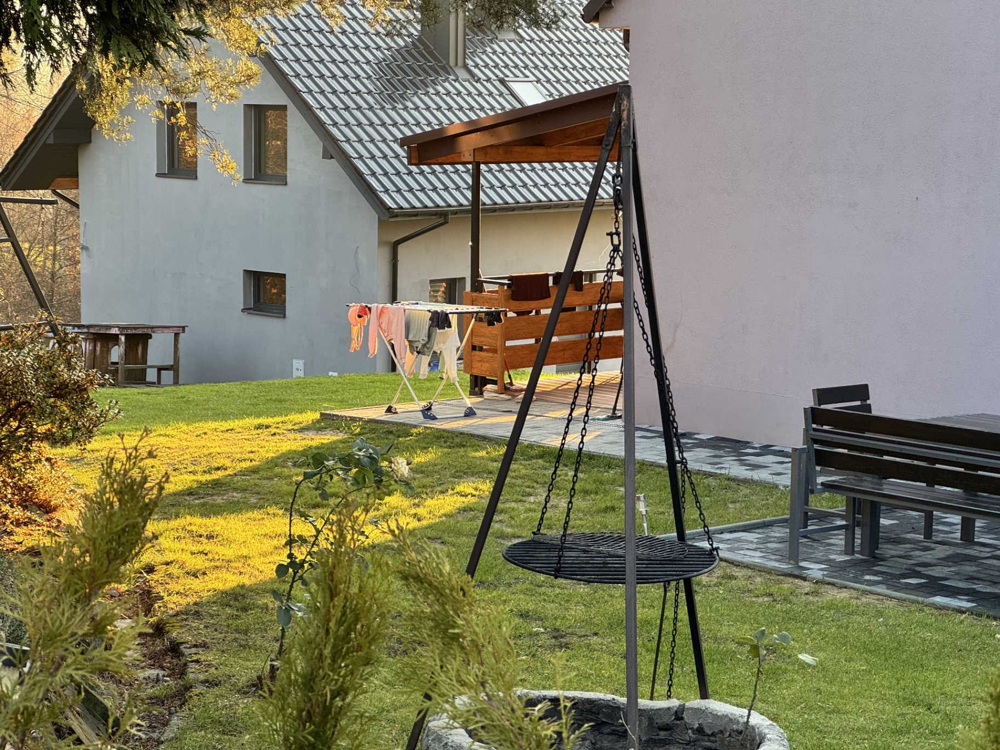
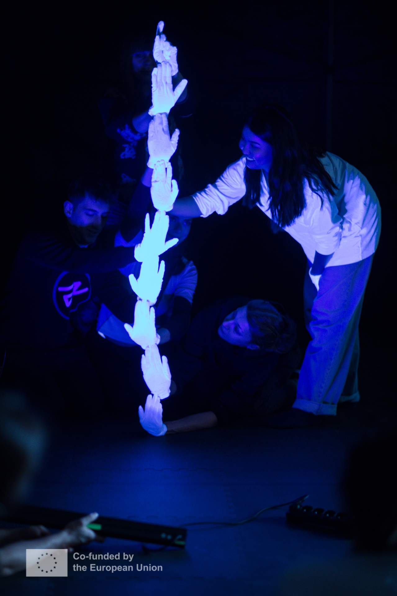
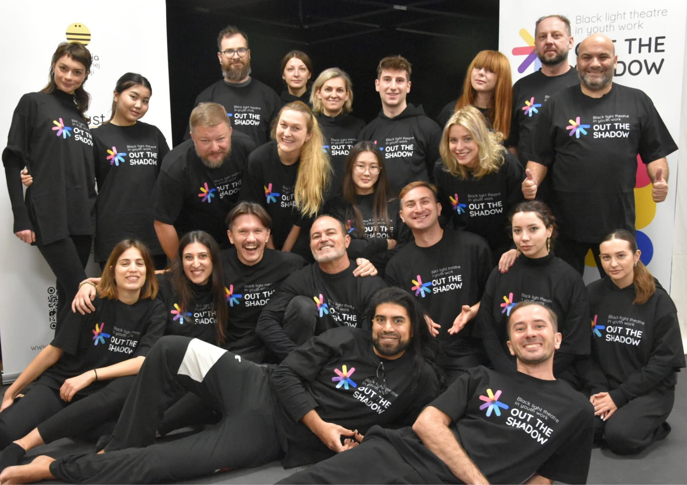

Pour ceux d'entre vous qui ont déjà lu mon autre article sur le projet « Breaking the Wall of Extremism », vous savez peut-être déjà que je ne suis pas un expert dans le domaine du théâtre. Néanmoins, c'était mon deuxième projet dans ce domaine, alors j'ai commencé à me sentir un peu plus à l'aise avec moi-même et avec l'environnement que je savais devoir affronter. Cependant, cette fois, il y avait quelque chose de différent : il s'agissait de théâtre noir (Black Light Theatre).

Quand j'ai entendu parler du théâtre noir pour la première fois, je ne savais vraiment pas à quoi l'associer. Je n'en avais jamais entendu parler auparavant. Je ne pense même pas qu'il existe une traduction correcte dans ma langue maternelle, l'italien. J'ai donc commencé à me renseigner et à rassembler des informations. Je voulais le voir en pratique, alors j'ai surtout cherché des vidéos de représentations utilisant cette méthodologie, et honnêtement ? Ça avait l'air tellement bien que je me suis vite intéressé.

Quand ce projet a été proposé par mon ONG, j'ai immédiatement manifesté mon intérêt à participer. Non seulement parce que je voulais découvrir cette nouvelle méthodologie théâtrale, mais aussi parce que, comme vous l'avez peut-être déjà deviné d'après le titre, le projet se déroulait en Pologne.

J'avais déjà passé un peu de temps en Pologne auparavant, dans la capitale pour une fête du Nouvel An il y a quelques années avec des amis, et j'ai adoré chaque instant. C'était magique. Les gens étaient polis mais en même temps pas ennuyeux, ils savaient s'amuser. Les rues étaient propres et se déplacer dans la ville donnait un grand sentiment de sécurité. Je me suis donc dit que visiter une autre ville que la capitale serait encore mieux. Peut-être même plus authentique, vous voyez ?

Comme c'était ma deuxième fois en Pologne, j'ai décidé d'apprendre quelques bases de polonais. Même si c'est une langue très difficile (sérieusement, je ne saurais pas écrire l'orthographe des choses que j'ai apprises comme « bonjour », « comment ça va » ou « au revoir »), je sais au moins les prononcer. Et croyez-moi, les gens me sourient quand je dis ces phrases au lieu de leur balancer directement un « hello » en anglais ou de commencer tout de suite à commander en anglais. Il y a quelque chose que les gens apprécient vraiment quand on fait l'effort d'apprendre leur langue locale. Cela a été super utile parce que, dans un petit village, tout le monde ne parlait pas anglais, donc je devais parfois me faire comprendre. Bien que ce ne soit pas très compliqué car, comme beaucoup le savent, les Italiens sont fondamentalement des maîtres de la communication. Même quand nous ne parlons pas votre langue, nous trouvons toujours un moyen de vous faire comprendre ce que nous essayons de dire. Les gestes des mains sont un langage universel, non ? Donc ce n'était pas vraiment un problème pour moi.

Arriver dans cette petite ville, Dobczyce, a été plus facile que prévu. J'ai atterri à Cracovie, où l'organisation d'accueil avait prévu un bus privé qui nous a conduits directement sur le lieu. C'était agréable de rencontrer des gens d'autres pays participants et de bavarder un peu avant d'atteindre l'endroit où nous allions passer une semaine ensemble, à expérimenter le théâtre. Vous savez, cette classique conversation du « tu viens d'où ? » qui, on ne sait comment, ne lasse jamais lors de ces voyages.

Cette expérimentation a été particulièrement instructive, en partie grâce aux vastes connaissances des formateurs. Ils étaient compétents non seulement dans le domaine du BLT (Black Light Theatre) mais aussi dans bien d'autres. Tous les deux sont de véritables acteurs, donc ils savent vraiment ce qu'ils font. Ils ont su nous laisser expérimenter un peu d'autres méthodologies aussi. Je me souviens qu'on a fait un peu de théâtre d'ombres, et c'était sympa également. En gros, on a pu jouer avec différentes techniques, ce qui maintenait l'intérêt.

L'hôtel où nous logions était pratiquement au milieu de nulle part, et je ne dis pas cela comme un défaut. J'ai au contraire apprécié, car cela m'a vraiment permis, comme beaucoup d'autres je pense, de me déconnecter de ce mode de vie urbain frénétique. Vous savez, le genre de mode de vie que je mène quand je suis de retour à Paris. Être en pleine nature, entouré de beaux arbres, sans bruit d'ambulances ni de voitures filant à travers la ville, c'était honnêtement quelque chose que j'ai beaucoup apprécié. C'est étrange comme parfois ne rien faire du tout au milieu de nulle part peut donner l'impression de tout faire, si ça a du sens.

Un point sur lequel les avis étaient un peu partagés, du moins pour l'équipe italienne, c'était la nourriture. Il y avait des gens comme moi qui appréciaient vraiment ce qui était servi (la cuisine polonaise traditionnelle), et d'autres qui n'aimaient presque rien. Ils se plaignaient de pratiquement chaque repas. Honnêtement, pendant ce projet, j'ai découvert un nouvel amour pour la soupe de betterave, ce que je n'avais jamais goûté auparavant.

Je me souviens quand ils ont apporté le bol avec cette soupe très rouge. J'étais assis là à me demander : « Qu'est-ce que c'est et pourquoi est-ce SI rouge ? Ils ont mis du colorant alimentaire ou quoi ? » Tout le monde disait : « Oh, c'est de la soupe de betterave. C'est très polonais. C'est très courant d'avoir ce genre de plat quand il fait froid dehors. » Je ne savais même pas ce que voulait dire « beetroot » en anglais, j'ai donc dû le chercher. Quand j'ai vu la traduction, je me suis dit : « Attends, je n'ai jamais mangé ça de ma vie ! » Et quand je l'ai goûtée ? Tellement. Bonne. Maintenant, chaque fois que je vais à l'étranger, surtout dans des pays comme la Pologne ou d'autres pays nordiques où ils ont davantage l'habitude de ce genre de nourriture, j'essaie toujours d'en prendre une, parce que c'est honnêtement délicieux. Qui aurait cru qu'une soupe rouge pourrait changer ma vie ?

Pour en revenir au projet lui-même, nous avions un objectif principal dès le départ : créer une représentation finale. Ainsi, toutes les choses que nous apprenions au fil des journées de formation menaient à ce grand spectacle final. Et le plus cool ? Il a été diffusé en direct sur YouTube. Vous pouvez le regarder ici si vous êtes curieux : <https://www.youtube.com/watch?v=06qwUUAAmX8>

Je suis vraiment reconnaissant d'avoir pu participer à ce projet. Comme il s'agit d'un projet en cours, avec plusieurs mobilités prévues dans les années à venir, j'espère vraiment pouvoir participer aux prochaines aussi. Je croise les doigts pour qu'ils m'acceptent à nouveau, parce que je suis vraiment prêt pour un deuxième tour.

