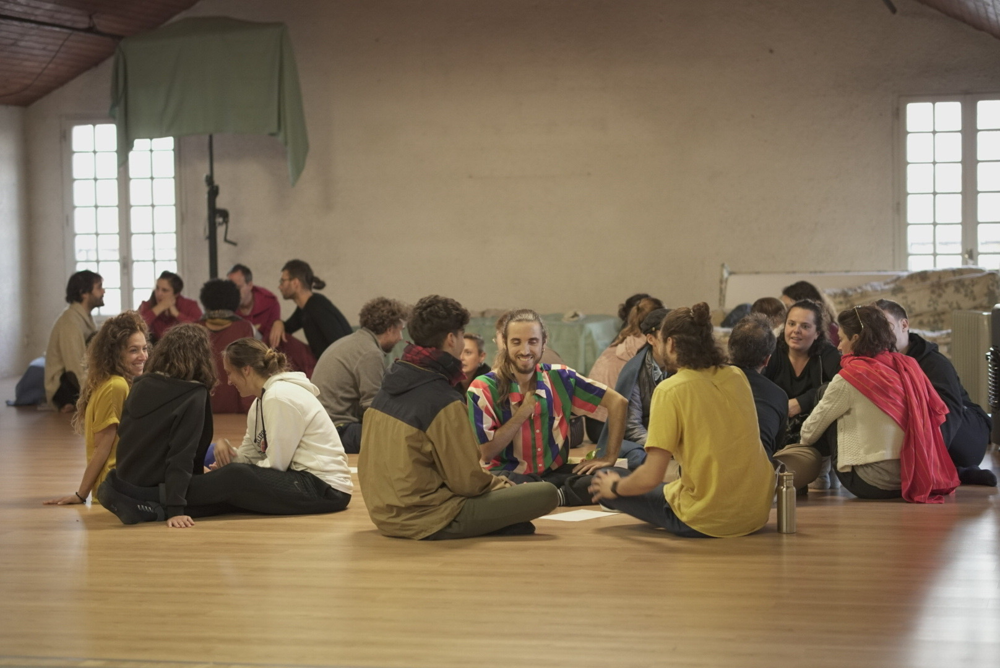
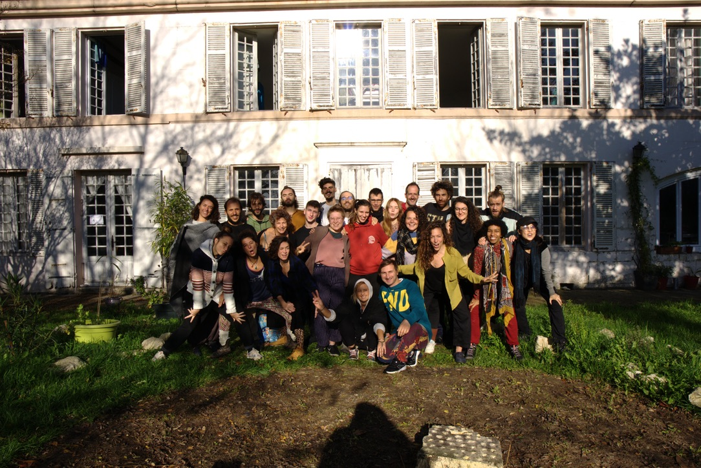

## Introduzione: perché era importante

Viviamo in una società in cui il linguaggio verbale è considerato la principale forma di comunicazione. Di conseguenza, il corpo viene spesso ignorato o messo a tacere attraverso stigma, tabù e condizionamenti socio-culturali. Youth in Contact è nato per mettere in discussione questo squilibrio. Attraverso il Contact Improvisation e pratiche centrate sul corpo, il progetto mirava a riconnettere i partecipanti con la comunicazione fisica e la consapevolezza corporea.

Ho partecipato a questo progetto Erasmus+ con l'ONG italiana Hermes Academy. È stata la mia prima esperienza Erasmus+ e ha cambiato profondamente il mio modo di pensare al tatto, alla comunicazione e all'apprendimento. Il fatto che si sia svolto durante la pandemia di COVID-19 ha reso l'esperienza ancora più intensa e significativa.

## Cos'è il Contact Improvisation (CI)

Il Contact Improvisation è nato negli anni '70, con Steve Paxton come uno dei suoi principali pionieri. Alla base, il CI consiste nell'ascoltare il peso, l'equilibrio, lo slancio e la presenza dell'altra persona. Non esiste un corpo ideale o perfetto. La pratica valorizza invece lo scambio, la responsabilità condivisa e la fiducia reciproca.

Il CI rompe le gerarchie tradizionali presenti nella danza. Include persone di età, generi e abilità diverse, compresi danzatori con disabilità. Esiste in contesti artistici, educativi e terapeutici ed è ampiamente utilizzato nell'educazione.

Studi psicologici sottolineano l'importanza del contatto fisico per la salute mentale e lo sviluppo dell'identità. Quando le società normalizzano la disconnessione dal corpo, possono emergere conseguenze come la dissociazione e la depersonalizzazione. Il CI funziona come uno strumento per ripristinare la consapevolezza corporea e ricostruire il legame umano attraverso la comunicazione non verbale.

## Panoramica del progetto

Youth in Contact si è svolto a Chérac, in Francia, dall'inizio di ottobre all'inizio di novembre 2020. Partecipanti di diversi paesi europei hanno vissuto e lavorato insieme, prendendo parte a laboratori, sessioni di improvvisazione e attività di gruppo. La metodologia combinava il Contact Improvisation, la pedagogia del movimento e la riflessione collettiva, con una forte attenzione all'inclusione e al consenso.

Il progetto si è svolto durante la pandemia di COVID-19, il che ha reso il contesto impegnativo. Mascherine, restrizioni e incertezza facevano parte della vita quotidiana. Nonostante ciò, gli organizzatori sono riusciti a portare avanti il progetto. Tuttavia, a metà percorso, la Francia ha annunciato un lockdown nazionale, costringendo il progetto a concludersi in anticipo affinché i partecipanti potessero tornare in sicurezza nei loro paesi.

## La mia esperienza personale

Questo è stato il mio primo progetto Erasmus+. Avevo già esperienza di danza classica e moderna durante l'infanzia, quindi il movimento mi era familiare, ma il Contact Improvisation era completamente nuovo. Praticare il contatto fisico durante una pandemia era insolito e impegnativo, ma anche profondamente significativo.

**Ciò che mi ha colpito:**

- **Reimparare il contatto fisico.** Dopo mesi di distanziamento sociale, il progetto ha creato un ambiente sicuro in cui il tatto veniva negoziato in modo consapevole e rispettoso.
- **Comunicare oltre le parole.** L'inglese era la lingua principale, ma erano presenti anche il francese e altre lingue. Il corpo diventava spesso lo strumento di comunicazione più efficace.
- **L'inclusione nella pratica.** Il CI ha permesso a persone con corpi e background molto diversi di partecipare in modo paritario, arricchendo l'esperienza.
- **Una dimensione terapeutica.** Alcune sessioni mi hanno aiutato a riconoscere schemi di tensione ed evitamento e mi hanno offerto modi semplici per affrontarli.
- **L'impatto della pandemia.** Concludere in anticipo è stato stressante, ma era l'opzione più sicura per tutti i coinvolti.

Nonostante l'interruzione, sono molto grato di aver scelto di partecipare. L'esperienza mi ha ricordato quanto possa essere potente l'apprendimento corporeo e quanto sia essenziale il legame fisico quando gestito con cura e consenso.

## Punti chiave

Per chiunque sia interessato a organizzare progetti simili o a parteciparvi:

- Regole chiare su sicurezza e consenso sono essenziali.
- Il Contact Improvisation funziona come strumento di comunicazione, non solo come danza.
- L'inclusione dovrebbe essere centrale, non opzionale.
- Gli ambienti multilingue arricchiscono l'apprendimento corporeo.
- La flessibilità è cruciale, soprattutto in contesti instabili come una pandemia.

## Riflessioni finali

Youth in Contact è stato più di un progetto di danza. Ha offerto strumenti pratici per l'ascolto, la fiducia e la comunicazione non verbale. Ha approfondito il mio interesse per l'apprendimento corporeo e le sue applicazioni nell'educazione e nella salute mentale.

Se mai avrai l'opportunità di partecipare a un progetto come questo, coglila. Aspettati disagio, crescita e legami autentici. Reimparare a relazionarti con gli altri attraverso il corpo è un'esperienza che resta a lungo dopo la fine.

